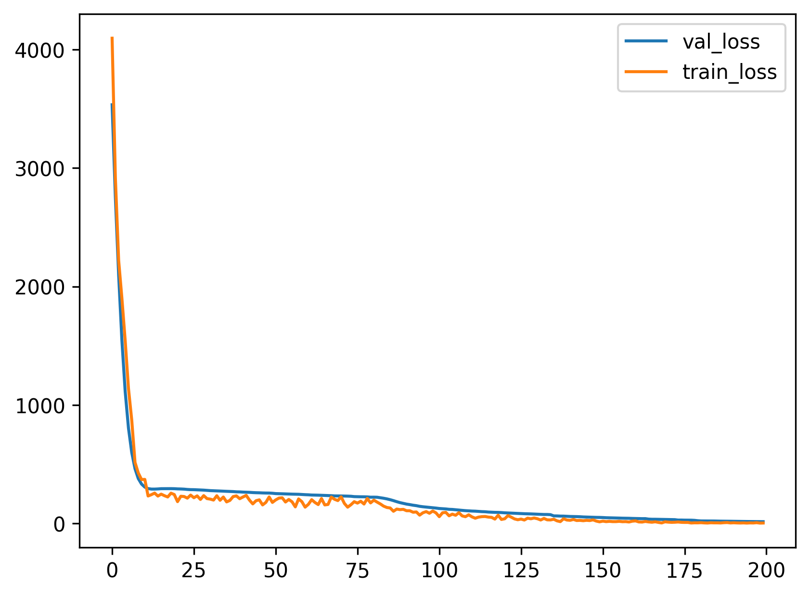
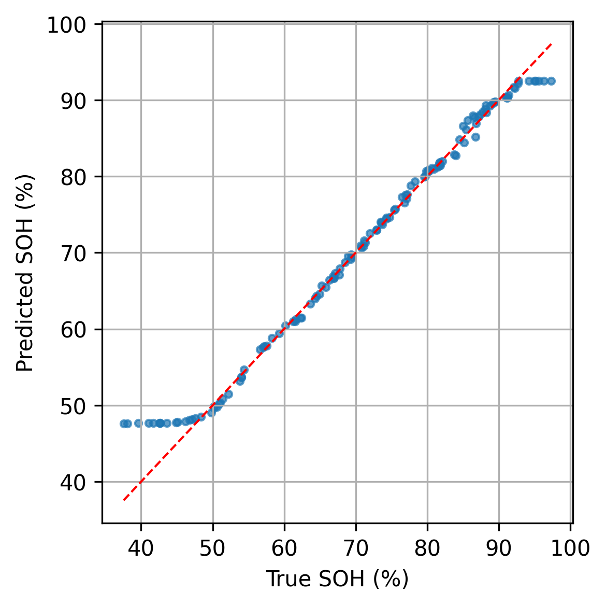
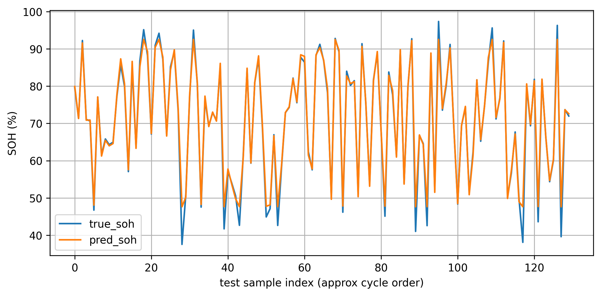
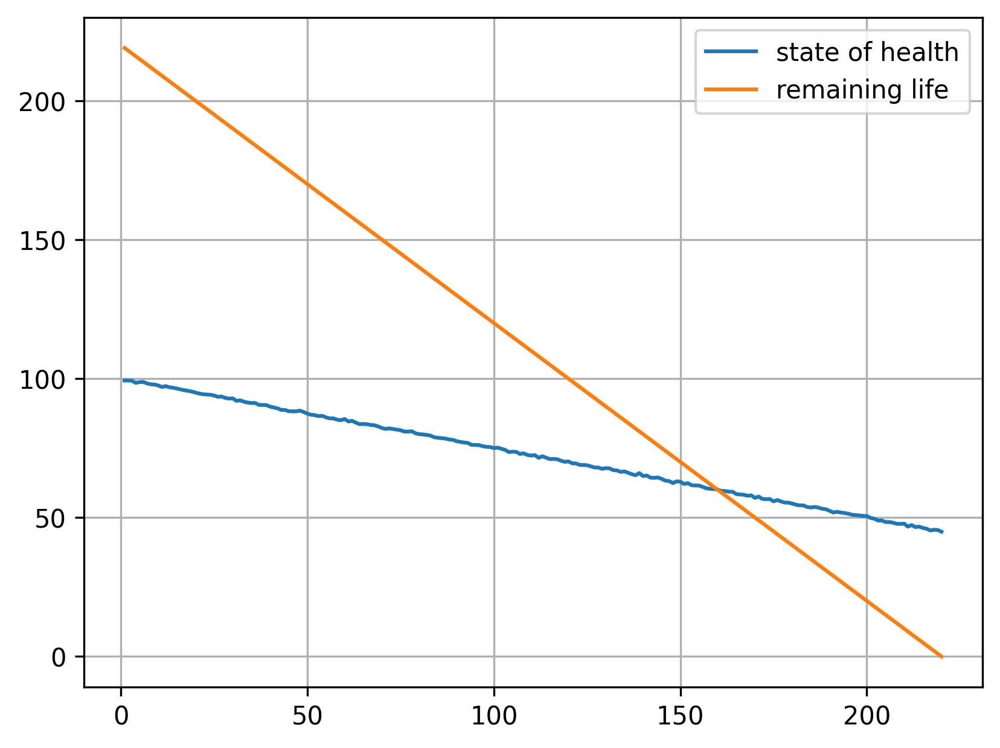

# 🔋 Lithium-Ion Battery SOH & RUL Prediction

This repository contains a deep learning pipeline using Long Short-Term Memory (LSTM) networks to predict the **State of Health (SOH)** and **Remaining Useful Life (RUL)** of lithium-ion batteries.

The project applies time-series sequence modeling to cycle-level charge and discharge data, a core requirement for modern Battery Management Systems (BMS) in Electric Vehicles (EVs).

## 📊 Dataset

The model is trained on the Kaggle [Lithium-ion battery degradation dataset](https://www.kaggle.com/datasets/programmer3/lithium-ion-battery-degradation-dataset) (inspired by the NASA Ames prognostics data).

- Contains 680 samples across 3 batteries (B5, B6, B7).
- **Features extracted**: Charge/Discharge Current (`chI`, `disI`), Voltage (`chV`, `disV`), Temperature (`chT`, `disT`), Cycle Index, and a capacity-like metric (`BCt`).

## 🧠 Methodology & Architecture

The data is standardized and windowed into **10-cycle sequences** to capture long-term degradation trends rather than just instantaneous state.

Two isolated models were trained for the distinct prediction tasks:

1. **SOH Prediction Model**:
   - **Architecture**: 1-layer LSTM (Hidden Size: 100) → Linear Layer
   - **Performance**: Converged with a final validation MSE ≈ `11`, which translates to an RMSE of roughly `3.3%` in SOH tracking.
2. **RUL Prediction Model**:
   - **Architecture**: 1-layer LSTM (Hidden Size: 150) → Linear Layer
   - **Performance**: Converged with a final validation MSE of `0.6` on normalized RUL targets (RMSE ≈ `0.8`).

## 📈 Results

The models demonstrate strong convergence and accurately map the non-linear degradation curves of the lithium-ion cells.

### SOH Prediction Convergence



### True vs Predicted SOH Scatter



### SOH Evaluation Across Cycles



### Battery Degradation Profile Example



## ⚙️ How to Run

1. Clone this repository:
   ```bash
   git clone https://github.com/abhishekspawar0803-svg/battery_life_cycle_nasa.git
   cd battery_life_cycle_nasa
   ```
2. Install dependencies:
   ```bash
   pip install torch pandas numpy matplotlib scikit-learn
   ```
3. Download the dataset from Kaggle and place it in the project root.
4. Open the Jupyter Notebook (`.ipynb`) and execute the cells sequentially.

## 🚀 Future Scope

- **Edge Deployment**: Quantize and deploy the trained models onto an ESP32 using TinyML frameworks for real-time BMS inference.
- **Physics-Informed Machine Learning (PINN)**: Integrate electrical circuit constraints to improve extrapolation accuracy on unseen battery profiles.
